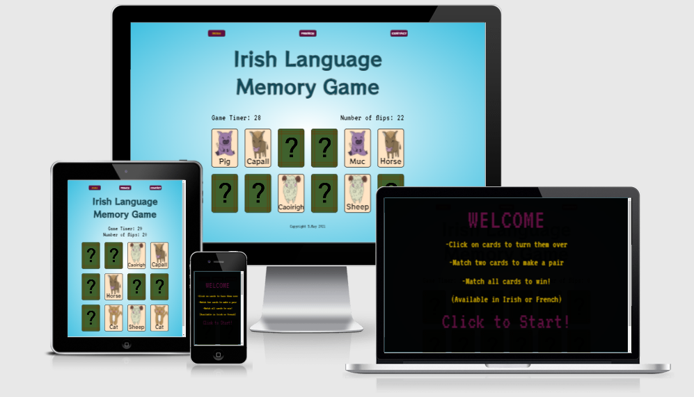
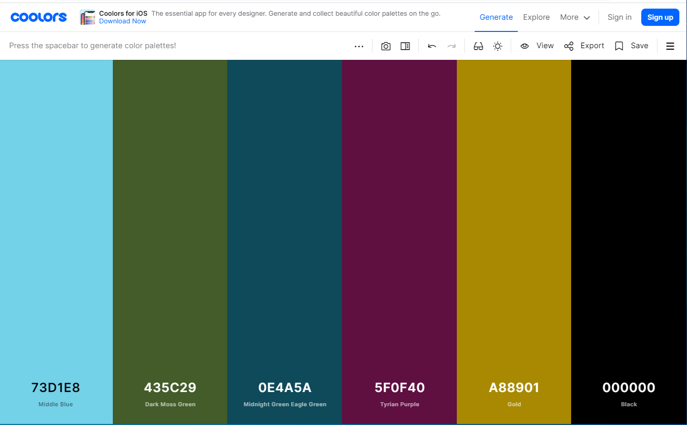

# MILESTONE PROJECT 2 - Language Acquisition Memory Game - Interactive Front End

## Project Summary:
### The goal of this project will be to design and create a simple pattern matching memory game using JavaScript, HTML and CSS. The main goal for both the user and the site owner will be to have a game that is enjoyable to play. I will also include a 'language acquisition' component to this memory game which will highlight the versatility of this type of project and how it can be utilised for educational purposes while still being enjoyable which should expand the appeal of this website to a wider audience. 

### **MOCKUPS**

A digital render of how the site would look on different devices and screen sizes 

### Contents - 

* [**STRATEGY**]

* [**USER STORIES**]

* [**SCOPE**](#scope)

* [**STRUCTURE**](#structure)

* **SKELETON**

* **SURFACE**

* **FEATURES**

* **FUTURE FEATURES**

* **TECHNOLOGIES USED**

* **TESTING**

* **BUG FIXES**

* **IMPLEMENTATION ISSUES**

* **DEPLOYMENT**

* **CREDITS**

* **CONTENT**

* **MEDIA**

* **ACKNOWLEDGEMENTS**

### [**STRATEGY -**](#strategy)

#### SITE OWNER GOALS:
The main goal of this project is to create an interactive website which hosts a single player, pattern matching game with a language acquisition component. This game should be fun for any user and should make the user want to return to the website to play again. This will hopefully be achieved by using fun and unique images and music throughout this project. The language acquisition component will hopefully broaden the appeal of this game to users, educators and parents which should will mean a higher base of users and more people who could potential enjoy playing the game and have fun!  

Target audience 
- People who like games 
- Early language learners
- Parents of young game users
- Educators

#### User stories(#user-stories)

Website user -

1. As a user I want a fun experience 
2. As a user I want to be able to play the game by being given the instructions needed but with as minimal instructions as possible
3. As a website user I want to be able to navigate the website easily and intuitively
4. As a user I want a consistent playing experience, that is the same every time I come back to the website and on any device

Early Language Users - 

5. As a language learner I want the words I am trying to learn to be displayed clearly
6. As a language learner I want to be challenged to remember words
7. As a language learner I want to play in multiple languages

Parents of Young Game Users - 

8. As the parent of a young game user I want my child to learn while playing a game
9. As the parent of a young game user I want the game to be safe and the content appropriate
10. As the parent of a young game user I want my child to have fun learning

Educators - 

11. As an educator I want a learning resource that will engage my students
12. As an educator I want a learning resource that will encourage my students to learn while having fun
13. As an educator I want a learning resource that is free and easy to access 

Website Owner - 

14. As the website owner I want the users to have fun playing the game
15. As the website owner I want the users to be engaged by the content of my website
16. As the website owner I want the users to return to my website
17. As the website owner I want users to be able to contact me to share their feedback

### **SCOPE -**(#scope)

This project will be a minimal viable product containing the aspects that are vital to functionality and an acceptable standard of aesthetic value, but with lots of opportunity to develop further in the future.

Functional specifications: 
- Navigation
- Card Flip mechanism
- Card Match mechanism
- Email contact form

Content specifications:
- Tutorial overlay
- Custom artwork
- Custom music
- Win/Lose overlays

### **STRUCTURE -**

The website is laid out over three pages. 
These pages are 
1.Landing Game Page (Game in English/Irish) 
2.Secondary Game Page (Game in English/French)
3.Contact Page 

The two game pages (1 + 2)contain three overlays, these will instruct the player: 
- How to play
- Tell users if they have won the game
- tell users if they have lost the game
When a player clicks on this first overlay (after being prompted on screen to click) the game will begin. When this happens the background music will start and a timer, which will start at 100 seconds, will begin to countdown to zero. When the timer reaches zero the game will end. 

Pages 1 & 2 will contain 12 cards which will resemble playing cards. These cards will each contain a different image of an animal (repeating twice) to create six pairs of cards. Each pair will have the name of the animal that it contains written on it, one will have the English and the other will have the Irish (or French on Page 2) on it. On the reverse side all cards will be identical, containing a farmyard fence and a question mark. When a player clicks on a card it will flip over and they must select a second card to find it's match. If the player finds all 6 matches before the 100 seconds is over then they will win the game and the 'Victory' overlay will appear on screen. If they cannot find both matches before the 100 seconds elapses then they will lose and the 'Lose' overlay will appear on screen. A 'click to restart' prompt will appear on both of these screens. 

The contact page (pg3) will contain a very simple feedback form that will send an email to the author of the website. When all fields are correctly filled out and the feedback has been successfully sent, a thank you message will appear in the feedback box. 

### **SKELETON -** 

Differences between final design and wireframes:

There were no major differences between the final design or the website and the original wireframes. One slight adjustment was made to the wireframes for the first two pages of the site (Landing Game Page and Secondary Game Page) and mobile display adjustments needed to be made to the number of columns that were displayed and this changed from an original plan of 3 columns to the final layout of 2 columns at that media size. The contact page was kept in a very simple style which was scalable across all media sizes. As can be seen from the wireframe model below, the layout remained consistent. 

##### Created at the outset of the project to direct the stylistic development. 

### **SURFACE -**

Typography -
Two fonts were chosen for this project - 

The first of which is ‘RocknRoll One’  - This font was chosen for it’s fun and playful style which maintained it’s visual form while using colour within. 

The second font used is ‘VT32‘ – This pixelated font was chosen because it is reminiscent of a retro game style and evokes an old-school aesthetic.

Colour scheme -

The author used Coolers.com to create a consistent and visually appealing colour palette for this project. Accessibility was also a concern so the author ensured that all colours of text used were done in a highly contrasting and visually pleasing manner .

Images -

A fun and interactive aesthetic was utilised for this project.  The desired effect would aim to make the user more comfortable and create an accessible space for any user to learn some new words for farm-yard animals in different languages, but more importantly have fun. All images were custom created by the author specifically for this project. 

### **FEATURES**

- Media responsiveness on all device sizes
- Navigation buttons that link to all pages
- Navigation buttons includes user feedback for click
- Game is available in two languages (Irish and French)
- Game includes a tutorial screen at startup
- Card Game includes 6 custom designed cards with names of animals in 3 languages
- Game includes a countdown timer
- Game includes a ‘flip counter’
- Card Game includes custom made Background music, Victory music and Game Over music
- Card Game includes user feedback through unique custom made audio cues (flip and correct match)
- Contact page form has form with ‘value needed’ function
- Contact page has full functionality 
- Contact page button submits user feedback

### **FUTURE FEATURES**

- User name prompt and input to be used and stored
- User scores (number of flips) to be stored and displayed in a highscore field
- Learned words feature which displays which cards have been matched and the corresponding words for those animals
- Game made available in different languages
- Game made available with new 'decks' containing different words/images
- Game to include a mute music function

### **TECNOLOGIES USED**

HTML – For creating website

Css – For styling website

Bootstrap – Used Bootstrap grid system, navbar, carousel and called classes

JavaScript – For creating functions and interactive elements on project

Jquery - 

Adobe XD – For creating wireframes

Adobe Photoshop – For editing images to consistent sizes and adjusting
 styles

Beepbox.co – Used to create the music and sounds used in project

Email.js – For email functionality on contact page

Git – Used for Version control

Gitpod – For code editing and testing

GitHub – For storing repository

Chrome Dev Tools – For editing changes in real time and checking styles in different media sizes

Chrome Lighthouse – For checking page performance

W3C CSS - For validating CSS code

W3C HTML – For validating and ensuring HTML code was correct/valid.

Coolers (website) - For creating a custom colour palette for project

FreeFormatter (website) - For validating HTML code

AutoPrefixer Online – For CSS parsing and adding vendor prefixes

AmIResponsive (website) - To ensure site is responsive and create mockup

### **TESTING**

**Code tests -**

The CSS code was passed through W3C CSS Validator and final version contained no errors. It was also passed through AutoPrefixer Online to parse CSS and add vendor prefixes.

The HTML code was passed through W3C HTML Validator and FreeFormatter.com to ensure final version contained no errors.

The JavaScript was tested using debugging tests by the author throughout the development.

**Dev tests -**

(i)Chrome Developer Tools -

Chrome Developer Tools were used throughout this project and were greatly relied on to make all manner of adjustments and changes to project.

(ii)Chrome Lighthouse -

Chrome Lighthouse was used to ensure that the website has been deployed in the most efficient way possible – the screen shots below reflect the score of this project under four headings 
    • Performance
    • Accessibility
    • Best Practices
    • SEO
To bring this project to score this high some changes were made in all four categories to raise the score to be all registering at the highest bracket (90% +). 

These changes included - 
1. Performance: 
    • Added ‘defer’ to the font styles to allow a faster load of base site 
    • Removing ‘unessecary CSS’ 
These two changes increased score in Performance from 76% to 99%. 
2. Accessibility:
    • Added new colours to increase contrast to improve visability. 
This change increased score in Accesibility from 86% to 100%. 
3. Best Practices:
    • Images were changed to correct aspect ratio
    • Images that had been displayed at low resolution were replaced
These two changes increased score in Performance from 86% to 99%. 
4. SEO:
    • Added meta description to document 
This change increased score from 92% to 100%. 

** INSERT SCREENSHOTS HERE **

Function tests -

This site was tested many times manually throughout the development process by the author and friends and family to ensure that it's functions behave exactly as they are intended to. This process was again repeated when hosted to ensure that there were no changes to functionality. 

Response tests -

The site was tested across all media query sizes and at all possible breaking points to ensure that a consistent and responsive experience was ensured for the user on any device. The author also used AmIResponsive.com to ensure that this was double checked. 

Browser tests -

Though the sote was developed through Google Chrome, after it had been deployed online it was tested across all other major browsers to make sure that it was fully operational. These browsers included Chrome, Safari, Firefox and Opera.  

User story tests -

Website user -

1. As a user I want a fun experience 
- Game is fun to play 
2. As a user I want to be able to play the game by being given the instructions needed but with as minimal instructions as possible
- Game includes instructions in the startup overlay but doesn't overwhelm user with information
3. As a website user I want to be able to navigate the website easily and intuitively
- Website has clearly labelled buttons that can be used to navigate website
4. As a user I want a consistent playing experience, that is the same every time I come back to the website and on any device
- Website has been tested at all different media sized and is fully responsive to changes while keeping consistent experience for user

Early Language Users - 

5. As a language learner I want the words I am trying to learn to be displayed clearly
- Words on cards are displayed clearly with good contrast
6. As a language learner I want to be challenged to remember words
- Game shuffles location of cards after every game making for a more challenging user experience
7. As a language learner I want to play in multiple languages
- Game is available to play in English/Irish & English/French

Parents of Young Game Users - 

8. As the parent of a young game user I want my child to learn while playing a game
- This game includes a simple language acquisition component which helps teach words to user
9. As the parent of a young game user I want the game to be safe and the content appropriate
- This game is safe and the content included is appropriate for younger users
11. As the parent of a young game user I want my child to have fun learning

Educators - 

10. As an educator I want a learning resource that will engage my students
- Through the use of custom graphics and music this website is engaging for users
11. As an educator I want a learning resource that will encourage my students to learn while having fun
- This game encourages the user to remember where animals/words are which engages learning while also being fun to play
12. As an educator I want a learning resource that is free and easy to access 
- This game is free and easy to access and start playing across any platform

Website Owner - 

13. As the website owner I want the users to have fun playing the game 
- This game is fun for users
14. As the website owner I want the users to be engaged by the content of my website 
- This website is engaging to users
15. As the website owner I want the users to return to my website 
- This game has multiple languages and is fun and engaging so users would return to it
16. As the website owner I want users to be able to contact me to share their feedback 
- This game features a contact page which includes an email feedback form so users can offer feedback to the website owner

Website -

### **BUG FIXES -**

### **IMPLEMENTATION ISSUES**

### **DEPLOYMENT -**

Git Hub Pages -

This project was developed in the Gitpod development environment. I initialised the project by creating a new repository for the project in GitHub and used this as a storing point to push the project to at various points through out the development process. Using the git add function I staged my code at many times and used the Git Commit command to save all changes. Finally, I used the Git Push command to send all the changes back to my repository on GitHub.
Git Hub Pages -
After site was completed I deployed the website to GitHub Pages using the settings feature on my project repository, scrolling to GitHub pages, choosing master as source and then saving the new pages link.

Creating clone of project -

To create a clone of this project you can access it through the link onf Git Hub Repository, click the clipboard to copy the url, this can then be brought to the terminal when a new working directory can be set up and the clone saved. Once this is done you can type ‘git clone’ and paste the url and press enter and a new clone will be created.

### **CREDITS -**

General -
    • HTML HEADER 
    • HTML BODY
    • HTML FOOTER
    • CSS STYLES 
    • CSS MEDIA QUERIES
    • CSS FLEXBOX
    • CSS ANIMATIONS/KEYFRAME
    • CSS TRANSFORM/TRANSLATE
    • CSS OVERLAYS
    • CSS CONTACT FORM
    • JS AUDIO CONTROLLERS
    • JS START GAME
    • JS FLIP CARDS/3D OBJECTS/Z-AXIS
    • JS OVERLAYS
    • JS EMAILJS
    • JS JQUERY 

### **CONTENT**

All text content was written by author 

### **MEDIA**

All images and music were custom designed and created specifically for this project.

### **ACKNOWLEDGEMENTS**

- Code institute
- Mentor (Spencer Shelton)
- Slack Community
- Friends and Family (for testing)
    

